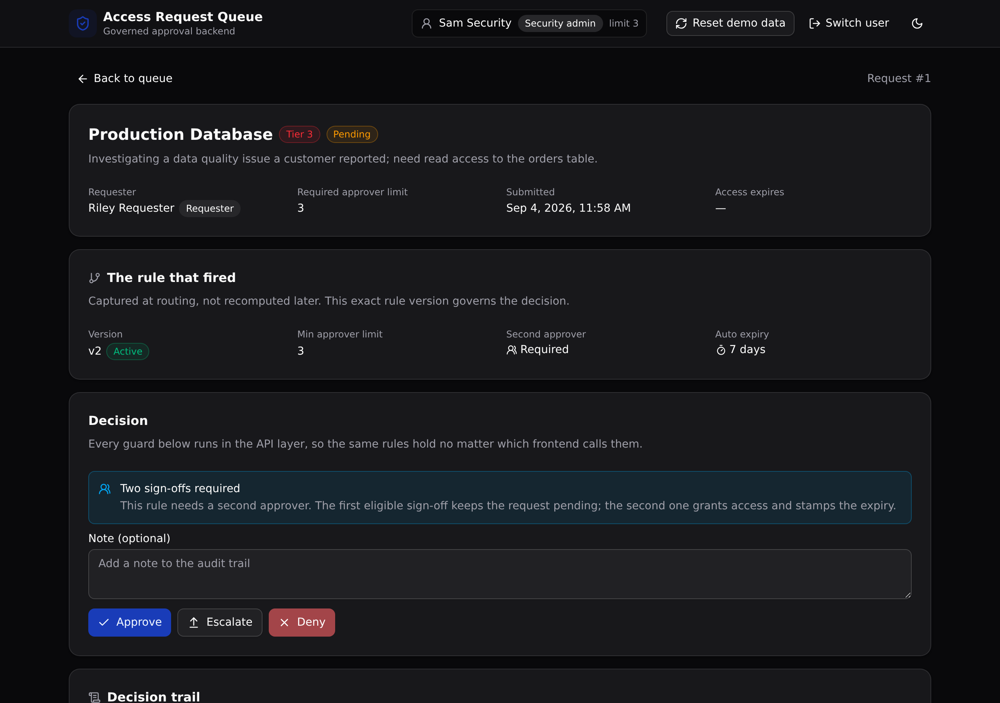

# Access Request Queue

The governed backend under an AI-built internal access-request tool. Every approval is routed by a versioned rule, checked against segregation of duties, and written to an audit trail, all in one Xano API layer the frontend cannot go around.



**Play 3 (Pilot to Production)** · identity and access governance · 5 tables · 10 API endpoints · native API-layer RBAC, no add-ons

## What it demonstrates

A team builds an internal access-request tool fast (Bolt, Lovable, v0, Replit). Then someone has to make it safe for production. The rules that decide who may approve what do not belong in the frontend, because a rebuilt frontend would carry them off. Here they live in the Xano API layer instead:

- **Role-based access control.** A requester, an approver, and a security admin see and can do different things. The role is checked on every endpoint.
- **Segregation of duties.** You cannot approve your own request.
- **Approval thresholds.** An approver can only sign off up to their limit. A request above that limit is forced to an escalation.
- **Versioned rules.** Each system and risk tier has one active rule. Superseded versions are kept, so the history is visible, not overwritten.
- **An append-only audit trail.** Every decision is recorded with its actor and time, and rows are only ever inserted.
- **Auto-expiry.** Granted access expires after a set number of days, swept by the backend.

Swap the React frontend for another one and none of that moves, because it was never in the frontend. That is the point of the play: the control lives in one governed API layer a technical reviewer can read and trust.

The vertical is enterprise access governance, the kind of control a regulated bank or a government team needs (separation of duties, auditable approvals).

## Repo layout

```
access-request-queue/
├── xano/                     the backend, authored in TypeScript with @xanots/sdk
│   ├── index.ts              the workspace, registering every table and endpoint
│   ├── tables/               users, systems, approval_rules, access_requests, approvals
│   ├── api/                  the API group and the ten endpoints
│   └── xano.lock             pins each object's identity across deploys (committed)
├── frontend/                 React + Vite + Tailwind v4 + shadcn/ui
│   └── src/lib/api.ts         the one contract: paths and types come from the query defs
└── docs/                     the landing page and the screenshot
```

## API surface

All endpoints live under the pinned `api:access` group.

| Method | Path | What it enforces |
| --- | --- | --- |
| POST | `/api:access/login` | Checks the password against the `users` auth table and mints a token |
| POST | `/api:access/requests` | Submits a request, routes it through the active rule, and captures which rule fired |
| GET | `/api:access/requests` | Lists the queue, scoped to the caller's role in the backend |
| GET | `/api:access/requests/{id}` | Returns one request with its system, requester, rule, and audit trail |
| POST | `/api:access/requests/{id}/decide` | Approves, denies, or escalates under the role, self-approval, and threshold guards |
| POST | `/api:access/expire-sweep` | Expires access past its window and audits it (security admin only) |
| GET | `/api:access/systems` | Lists the systems for the request form |
| GET | `/api:access/rules` | Lists every rule, active and superseded (the versioning) |
| GET | `/api:access/people` | A small directory for display |
| POST | `/api:access/seed` | Resets and reseeds the demo data (also the in-app reset button) |

## Quick start

Clone it, deploy it, and you have a live backend in about a minute.

```bash
git clone https://github.com/xano-scratch/access-request-queue.git
cd access-request-queue
npm install
npx xanots login          # one-time browser auth with Xano
npm run xano:deploy       # builds the frontend, deploys, prints the live URL
```

Open the printed URL, click **Load demo data**, then sign in as any role. Every demo account uses the password `password123`:

- **Riley Requester** submits requests and sees only their own.
- **Avery Approver** (limit 2) approves up to tier 2. A tier-3 request forces an escalation.
- **Morgan Manager** (limit 3) approves up to tier 3, including the required second sign-off.
- **Sam Security** (security admin) sees every request and runs the expiry sweep.

To see the block for yourself, sign in as Avery, open a request Avery submitted, and try to approve it. The backend refuses (segregation of duties). Then open a tier-3 request from the queue's "Open a request by number" box and try to approve it. The backend records it as an escalation, because it is above Avery's limit.

## How a decision is guarded

`POST /api:access/requests/{id}/decide` runs its checks in order, and each one is a precondition in the API layer:

1. The caller is an approver or a security admin.
2. The caller is not the requester (segregation of duties).
3. The request is still pending.
4. On approve, the caller's limit must clear the request's required limit, or the action becomes an escalation.

When the rule that fired requires a second approver, the first eligible sign-off keeps the request pending; the second one grants access and stamps the expiry. Every action, including a forced escalation, appends one row to the trail.

## FAQ

**Is this row-level security?** No. Xano authorization is at the API layer (middleware and role-based access control). Each guard is a precondition on the endpoint, not a database row policy.

**Can the frontend skip a rule?** No. The rules run in the backend, so any client that calls the API gets the same answer. A rebuilt frontend inherits the same controls.

**Is the data real?** No. It runs on seed data in a throwaway environment. This is a demo, not a live production system.

**Why do the GET and POST on `/requests` share a path?** A query's identity in @xanots/sdk is its API group, its verb, and its name together, so `GET requests` and `POST requests` are distinct objects.

## License

MIT. See [LICENSE](LICENSE).
